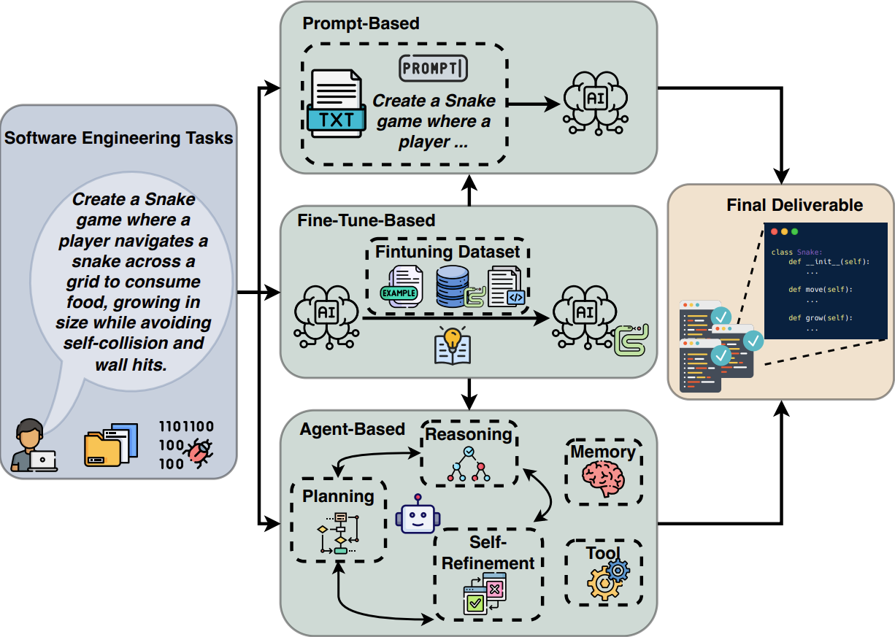
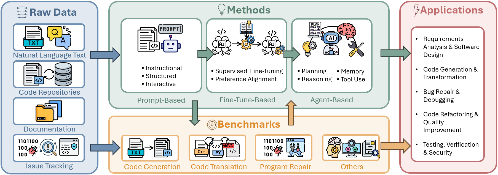
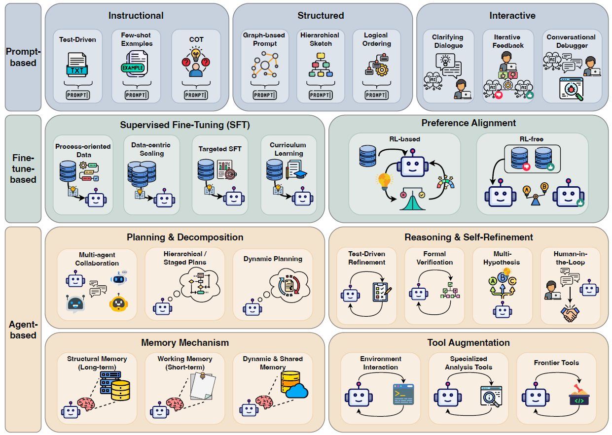

# LLM-Empowered Agentic Systems for Software Engineering Survey

<!-- > **A Comprehensive Survey on Benchmarks and Solutions in Software Engineering of LLM-Empowered Agentic System** - A Continuously Updated Repository of Papers and Resources -->

<!-- [](your-arxiv-link) -->
<!-- [](https://github.com/your-username/your-repo) -->
<!-- [](https://opensource.org/licenses/MIT) -->


<p align="center" width="100%">
  
  <br>
  Illustrations of process of LLM-empowered software engineering
</p>


## About This Project

This is a continuously updated repository of papers and resources focused on **LLM-Empowered Agentic Systems for Software Engineering**.

For detailed content, please refer to our survey paper: [**"A Comprehensive Survey on Benchmarks and Solutions in Software Engineering of LLM-Empowered Agentic System"**](your-paper-link)


If you find this project helpful for your research, please consider citing our work:

```bibtex
@misc{guo2025comprehensivesurveybenchmarkssolutions,
      title={A Comprehensive Survey on Benchmarks and Solutions in Software Engineering of LLM-Empowered Agentic System}, 
      author={Jiale Guo and Suizhi Huang and Mei Li and Dong Huang and Xingsheng Chen and Regina Zhang and Zhijiang Guo and Han Yu and Siu-Ming Yiu and Christian Jensen and Pietro Lio and Kwok-Yan Lam},
      year={2025},
      eprint={2510.09721},
      archivePrefix={arXiv},
      primaryClass={cs.SE},
      url={https://arxiv.org/abs/2510.09721}, 
}
```


## Table of Contents

<p align="center" width="100%">
  
  <br>
  Pipeline of our work.
</p>

- [Solutions](#solutions)
  - [Prompt-Based](#Prompt-Based)
  - [Fine-Tune-Based](#Fine-Tune-Based)
  - [Agent-Based](#Agent-Based)
- [Benchmarks](#Benchmarks)
  - [Code Generation](#Code-Generation)
  - [Code Translation](#Code-Translation)
  - [Program Repair](#Program-Repair)
  - [Others](#Others)
- [Applications](#Applications)
  - [Requirements Analysis & Software Design](#Requirements-Analysis--Software-Design)
  - [Code Generation & Transformation](#Code-Generation--ransformation)
  - [Bug Repair & Debugging](#Bug-Repair--Debugging)
  - [Code Refactoring & Quality Improvement](#Code-Refactoring--Quality-Improvement)
  - [Testing, Verification, & Security](#Testing-Verification--Security)


## Paper

### Solutions

<p align="center" width="100%">
  
  <br>
  The components of different types of solutions.
</p>

#### Prompt-Based

- The first prompt counts the most! an evaluation of large language models on iterative example-based code generation, *PACMSE*, 2025
- An exploratory study on architectural smell refactoring using Large Languages Models, *IEEE ICSA-C*, 2025
- Demystifying Feature Requests: Leveraging LLMs to Refine Feature Requests in Open-Source Software, *Requirements Engineering*, 2025
- AdaptiveLLM: A Framework for Selecting Optimal Cost-Efficient LLM for Code-Generation Based on CoT Length, *Internetware*, 2025
- Revisiting Chain-of-Thought in Code Generation: Do Language Models Need to Learn Reasoning before Coding?, *ICML*, 2025
- SynFix: Dependency-aware program repair via RelationGraph analysis, *ACL*, 2025
- LLM4TDG: test-driven generation of large language models based on enhanced constraint reasoning, *Cybersecurity*, 2025
- Can Long-Context Language Models Solve Repository-Level Code Generation?, *LTI Student Research Symposium 2025*, 2025
- SynFix: Dependency-aware program repair via RelationGraph analysis, *ACL*, 2025
- LLM4TDG: test-driven generation of large language models based on enhanced constraint reasoning, *Cybersecurity*, 2025
- Codes: Natural language to code repository via multi-layer sketch, *TOSEM*, 2024
- Test-driven development and llm-based code generation, *ASE*, 2024
- PACGBI: A Pipeline for Automated Code Generation from Backlog Items, *ASE*, 2024
- Do Current Language Models Support Code Intelligence for R Programming Language?, *TOSEM*, 2024
- Improving Repository-level Code Search with Text Conversion, *NAACL*, 2024
- Codes: Natural language to code repository via multi-layer sketch, *TOSEM*, 2024


#### Fine-Tune-Based

- SEAlign: Alignment training for software engineering agent, *ICSE*, 2026
- SWE-GPT: A Process-Centric Language Model for Automated Software Improvement, *PACMSE*, 2025
- D3: A Dataset for Training Code LMs to Act Diff-by-Diff, *COLM*, 2025
- Training Software Engineering Agents and Verifiers with SWE-Gym, *ICML*, 2025
- SWE-Dev: Building Software Engineering Agents with Training and Inference Scaling, *ACL*, 2025
- Building A Proof-Oriented Programmer That Is 64\% Better Than GPT-4o Under Data Scarcity, *ACL*, 2025
- MORepair: Teaching LLMs to Repair Code via Multi-Objective Fine-Tuning, *TOSEM*, 2025
- BLAZE: Cross-language and cross-project bug localization via dynamic chunking and hard example learning, *TSE*, 2025
- Improving fim code completions via context \& curriculum based learning, *WSDM*, 2025
- Automated High-Level Code Optimization for Warehouse Performance, *IEEE Micro*, 2025
- Smaller but Better: Self-Paced Knowledge Distillation for Lightweight yet Effective LCMs, *PACMSE*, 2025
- Risk Assessment Framework for Code LLMs via Leveraging Internal States, *FSE*, 2025
- Code Graph Model (CGM): A Graph-Integrated Large Language Model for Repository-Level Software Engineering Tasks, *NeurIPS*, 2025
- Do Code Semantics Help? A Comprehensive Study on Execution Trace-Based Information for Code Large Language Models, *EMNLP*, 2025
- Co-PatcheR: Collaborative Software Patching with Component (s)-specific Small Reasoning Models, *NeurIPS*, 2025
- On Pretraining For Project-Level Code Completion, *ICLR 2025 DL4C*, 2025
- Reasoning Through Execution: Unifying Process and Outcome Rewards for Code Generation, *ICML*, 2025
- Kimi k2: Open agentic intelligence, *arXiv preprint arXiv:2507.20534*, 2025
- Optimizing case-based reasoning system for functional test script generation with large language models, *ACM SIGKDD*, 2025
- Teaching an Old LLM Secure Coding: Localized Preference Optimization on Distilled Preferences, *ACL*, 2025
- Can It Edit? Evaluating the Ability of Large Language Models to Follow Code Editing Instructions, *COLM*, 2024
- Rest-mcts*: Llm self-training via process reward guided tree search, *NeurIPS*, 2024
- Selfcodealign: Self-alignment for code generation, *NeurIPS*, 2024

#### Agent-Based

- Agilecoder: Dynamic collaborative agents for software development based on agile methodology, *FORGE*, 2025
- Artemis ai: Multi-llm framework for code optimisation, *CAI*, 2025
- Long Context Scaling: Divide and Conquer via Multi-Agent Question-driven Collaboration, *ICML*, 2025
- Co-PatcheR: Collaborative Software Patching with Component (s)-specific Small Reasoning Models, *NeurIPS*, 2025
- You name it, I run it: An LLM agent to execute tests of arbitrary projects, *PACMSE*, 2025
- ExploraCoder: Advancing Code Generation for Multiple Unseen APIs via Planning and Chained Exploration, *ACL*, 2025
- Improving Automated Issue Resolution via Comprehensive Repository Exploration, *ICLR 2025 DL4C*, 2025
- AlphaVerus: Bootstrapping Formally Verified Code Generation through Self-Improving Translation and Treefinement, *ICML*, 2025
- Demystifying llm-based software engineering agents, *PACMSE*, 2025
- PatchPilot: A Cost-Efficient Software Engineering Agent with Early Attempts on Formal Verification, *ICML*, 2025
- Interactive debugging and steering of multi-agent ai systems, *CHI*, 2025
- PATCHAGENT: a practical program repair agent mimicking human expertise, *USENIX Conference on Security Symposium*, 2025
- SWE-Dev: Building Software Engineering Agents with Training and Inference Scaling, *ACL*, 2025
- An LLM-based Agent for Reliable Docker Environment Configuration, *NeurIPS*, 2025
- Are" Solved Issues" in SWE-bench Really Solved Correctly? An Empirical Study, *arXiv preprint arXiv:2503.15223*, 2025
- Human-in-the-loop software development agents, *ICSE-SEIP*, 2025
- ROSE: An IDE-Based Interactive Repair Framework for Debugging, *TOSEM*, 2025
- Nemotron-CORTEXA: Enhancing LLM Agents for Software Engineering Tasks via Improved Localization and Solution Diversity, *ICML*, 2025
- On Simulation-Guided LLM-based Code Generation for Safe Autonomous Driving Software, *EASE*, 2025
- Assistance or disruption? exploring and evaluating the design and trade-offs of proactive ai programming support, *CHI*, 2025
- LLM4TDG: test-driven generation of large language models based on enhanced constraint reasoning, *Cybersecurity*, 2025
- CodeV: Issue Resolving with Visual Data, *ACL*, 2025
- Alibaba lingmaagent: Improving automated issue resolution via comprehensive repository exploration, *FSE*, 2025
- Code Graph Model (CGM): A Graph-Integrated Large Language Model for Repository-Level Software Engineering Tasks, *NeurIPS*, 2025
- Towards detecting prompt knowledge gaps for improved llm-guided issue resolution, *MSR*, 2025
- BLAZE: Cross-language and cross-project bug localization via dynamic chunking and hard example learning, *TSE*, 2025
- AEGIS: An Agent-based Framework for Bug Reproduction from Issue Descriptions, *FSE*, 2025
- Enhancing Human-IDE Interaction in the SDLC using LLM-based Mediator Agents, *FSE*, 2025
- Automated Generation of Issue-Reproducing Tests by Combining LLMs and Search-Based Testing, *ASE*, 2025
- Coding Agents with Multimodal Browsing are Generalist Problem Solvers, *ICML 2025 Workshop on Computer Use Agents*, Unknown Year
- Training Software Engineering Agents and Verifiers with SWE-Gym, *ICML*, 2025
- Kimi k2: Open agentic intelligence, *arXiv preprint arXiv:2507.20534*, 2025
- Magis: Llm-based multi-agent framework for github issue resolution, *NeurIPS*, 2024
- MASAI: Modular Architecture for Software-engineering AI Agents, *NeurIPS 2024 Workshop on Open-World Agents*, 2024
- Codes: Natural language to code repository via multi-layer sketch, *TOSEM*, 2024
- LLMDFA: analyzing dataflow in code with large language models, *NeurIPS*, 2024
- Enhancing automated program repair with solution design, *ASE*, 2024
- Marscode agent: Ai-native automated bug fixing, *arXiv preprint arXiv:2409.00899*, 2024
- Building ai agents for autonomous clouds: Challenges and design principles, *SoCC*, 2024
- How to understand whole software repository, *arXiv preprint arXiv:2406.01422*, 2024
- Autocoderover: Autonomous program improvement, *ISSTA*, 2024
- Evaluating human-ai partnership for llm-based code migration, *CHI EA*, 2024
- Self-taught optimizer (stop): Recursively self-improving code generation, *First Conference on Language Modeling*, 2024
- What's wrong with your code generated by large language models? an extensive study, *arXiv preprint arXiv:2407.06153*, 2024
- On coordinating llms and platform knowledge for software modernization and new developments, *SSE*, 2024
- Evor: Evolving retrieval for code generation, *EMNLP*, 2024
- Swe-agent: Agent-computer interfaces enable automated software engineering, *NeurIPS*, 2024


### Benchmarks

#### Code Generation

- McEval: Massively Multilingual Code Evaluation, *ICLR*, 2025
- HumanEval Pro and MBPP Pro: Evaluating Large Language Models on Self-invoking Code Generation Task, *ACL 2025 Findings*, 2025
- BigCodeBench: Benchmarking Code Generation with Diverse Function Calls and Complex Instructions, *ILCR*, 2025
- EffiBench-X: A Multi-Language Benchmark for Measuring Efficiency of LLM-Generated Code, *NeurIPS*, 2025
- CLEVER: A Curated Benchmark for Formally Verified Code Generation, *NeurIPS*, 2025
- Automated Benchmark Generation for Repository-Level Coding Tasks, *Forty-second International Conference on Machine Learning*, 2025
- Can Language Models Replace Programmers for Coding? REPOCOD Says `Not Yet', *Proceedings of the 63rd Annual Meeting of the Association for Computational Linguistics (Volume 1: Long Papers)*, 2025
- HumanEvo: An Evolution-Aware Benchmark for More Realistic Evaluation of Repository-Level Code Generation, *ICSE*, 2025
- SWE-smith: Scaling Data for Software Engineering Agents, *NeurIPS*, 2025
- SWE-rebench: An Automated Pipeline for Task Collection and Decontaminated Evaluation of Software Engineering Agents, *NeurIPS*, 2025
- DyCodeEval: Dynamic Benchmarking of Reasoning Capabilities in Code Large Language Models Under Data Contamination, *Forty-second International Conference on Machine Learning*, 2025
- HumanEvalComm: Benchmarking the Communication Competence of Code Generation for LLMs and LLM Agents, *ACM Trans. Softw. Eng. Methodol.*, 2025
- The first prompt counts the most! an evaluation of large language models on iterative example-based code generation, *PACMSE*, 2025
- Maintaincoder: Maintainable code generation under dynamic requirements, *NeurIPS*, 2025
- Seccodeplt: A unified platform for evaluating the security of code genai, *NeurIPS*, 2025
- CodeScope: An Execution-based Multilingual Multitask Multidimensional Benchmark for Evaluating LLMs on Code Understanding and Generation, *ACL*, 2024
- Evaluating Large Language Models in Class-Level Code Generation, *Proceedings of the IEEE/ACM 46th International Conference on Software Engineering*, 2024
- Evaluation of LLMs on Syntax-Aware Code Fill-in-the-Middle Tasks, *Forty-first International Conference on Machine Learning*, 2024
- DevEval: A Manually-Annotated Code Generation Benchmark Aligned with Real-World Code Repositories, *ACL 2024 Findings*, 2024
- R2e: Turning any github repository into a programming agent environment, *ICML*, 2024
- XCodeEval: An Execution-based Large Scale Multilingual Multitask Benchmark for Code Understanding, Generation, Translation and Retrieval, *ACL*, 2024
- CrossCodeBench: Benchmarking Cross-Task Generalization of Source Code Models, *ICSE*, 2023
- Is your code generated by ChatGPT really correct? rigorous evaluation of large language models for code generation, *NeurIPS*, 2023
- CodeGeeX: A Pre-Trained Model for Code Generation with Multilingual Benchmarking on HumanEval-X, *Proceedings of the 29th ACM SIGKDD Conference on Knowledge Discovery and Data Mining*, 2023
- Evaluating large language models trained on code, *arXiv preprint arXiv:2107.03374*, 2021
- Program synthesis with large language models, *arXiv preprint arXiv:2108.07732*, 2021
- CodeXGLUE: A Machine Learning Benchmark Dataset for Code Understanding and Generation, *NeurIPS*, 2021
- CodeNet: A Large-Scale AI for Code Dataset for Learning a Diversity of Coding Tasks, *NeurIPS*, 2021

#### Code Translation

- CRUST-Bench: A Comprehensive Benchmark for C-to-safe-Rust Transpilation, *Second Conference on Language Modeling*, 2025
- AlphaTrans: A Neuro-Symbolic Compositional Approach for Repository-Level Code Translation and Validation, *Proc. ACM Softw. Eng.*, 2025
- Function-to-Style Guidance of LLMs for Code Translation, *ICML*, 2025
- CodeEditorBench: Evaluating Code Editing Capability of LLMs, *ICLR 2025 DL4C*, 2025
- Unraveling the Potential of Large Language Models in Code Translation: How Far are We?, *2024 31st Asia-Pacific Software Engineering Conference (APSEC)*, 2024
- XCodeEval: An Execution-based Large Scale Multilingual Multitask Benchmark for Code Understanding, Generation, Translation and Retrieval, *ACL*, 2024
- Evaluating Large Language Models in Class-Level Code Generation, *Proceedings of the IEEE/ACM 46th International Conference on Software Engineering*, 2024
- Repository-level code translation benchmark targeting rust, *arXiv preprint arXiv:2411.13990*, 2024
- Repotransbench: A real-world benchmark for repository-level code translation, *arXiv preprint arXiv:2412.17744*, 2024
- AVATAR: A Parallel Corpus for Java-Python Program Translation, *Findings of the Association for Computational Linguistics: ACL 2023*, 2023
- CodeTransOcean: A Comprehensive Multilingual Benchmark for Code Translation, *EMNLP 2023 Findings*, 2023
- CodeGeeX: A Pre-Trained Model for Code Generation with Multilingual Benchmarking on HumanEval-X, *KDD*, 2023
- On the Evaluation of Neural Code Translation: Taxonomy and Benchmark, *ASE*, 2023
- CrossCodeBench: Benchmarking Cross-Task Generalization of Source Code Models, *Proceedings of the 45th International Conference on Software Engineering*, 2023
- CodeXGLUE: A Machine Learning Benchmark Dataset for Code Understanding and Generation, *NeurIPS*, 2021
- CodeNet: A Large-Scale AI for Code Dataset for Learning a Diversity of Coding Tasks, *NeurIPS*, 2021

#### Program Repair

- CodeEditorBench: Evaluating Code Editing Capability of LLMs, *ICLR 2025 DL4C*, 2025
- RepoDebug: Repository-Level Multi-Task and Multi-Language Debugging Evaluation of Large Language Models, *EMNLP*, 2025
- LongCodeBench: Evaluating Coding LLMs at 1M Context Windows, *Second Conference on Language Modeling*, 2025
- Breakpoint: Stress-testing systems-level reasoning in LLM agents, *Second Conference on Language Modeling*, 2025
- Multi-SWE-bench: A Multilingual Benchmark for Issue Resolving, *NeurIPS*, 2025
- OmniGIRL: A Multilingual and Multimodal Benchmark for GitHub Issue Resolution, *Proc. ACM Softw. Eng.*, 2025
- CVE-Bench: Benchmarking LLM-based Software Engineering Agent's Ability to Repair Real-World CVE Vulnerabilities, *NAACL*, 2025
- SEC-bench: Automated Benchmarking of LLM Agents on Real-World Software Security Tasks, *NeurIPS*, 2025
- Seccodeplt: A unified platform for evaluating the security of code genai, *NeurIPS*, 2025
- DebugBench: Evaluating Debugging Capability of Large Language Models, *Findings of the Association for Computational Linguistics: ACL 2024*, 2024
- SWE-bench: Can Language Models Resolve Real-world Github Issues?, *ILCR*, 2024
- When Large Language Models Confront Repository-Level Automatic Program Repair: How Well They Done?, *ICSE-Companion*, 2024
- The GitHub Recent Bugs Dataset for Evaluating LLM-Based Debugging Applications, *ICST*, 2024
- CodeXGLUE: A Machine Learning Benchmark Dataset for Code Understanding and Generation, *NeurIPS*, 2021
- CodeNet: A Large-Scale AI for Code Dataset for Learning a Diversity of Coding Tasks, *NeurIPS*, 2021

#### Others

- CRUXEVAL-X: A Benchmark for Multilingual Code Reasoning, Understanding and Execution, *ACL*, 2025
- CodeJudge-Eval: Can Large Language Models be Good Judges in Code Understanding?, *COLING*, 2025
- Evaluating Program Semantics Reasoning with Type Inference in System F, *NeurIPS*, 2025
- CORE: Benchmarking LLMs' Code Reasoning Capabilities through Static Analysis Tasks, *NeurIPS*, 2025
- TestEval: Benchmarking Large Language Models for Test Case Generation, *NAACL 2025 Findings*, 2025
- TestGenEval: A Real World Unit Test Generation and Test Completion Benchmark, *ILCR*, 2025
- RefactorBench: Evaluating Stateful Reasoning in Language Agents Through Code, *ILCR*, 2025
- GSO: Challenging Software Optimization Tasks for Evaluating SWE-Agents, *NeurIPS*, 2025
- DI-BENCH: Benchmarking Large Language Models on Dependency Inference with Testable Repositories at Scale, *ACL 2025 Findings*, 2025
- Beyond pip Install: Evaluating LLM Agents for the Automated Installation of Python Projects, *SANER*, 2025
- SyncMind: Measuring Agent Out-of-Sync Recovery in Collaborative Software Engineering, *Forty-second International Conference on Machine Learning*, 2025
- CRUXEval: A Benchmark for Code Reasoning, Understanding and Execution, *ICML*, 2024
- SWT-Bench: Testing and Validating Real-World Bug-Fixes with Code Agents, *NeurIPS*, 2024


### Applications

#### Requirements Analysis & Software Design

- Demystifying Feature Requests: Leveraging LLMs to Refine Feature Requests in Open-Source Software, *Requirements Engineering*, 2025
- Clarigen: Bridging instruction gaps via interactive clarification in code generation, *AAAI 2025 Workshop on PDLM*, 2025
- Agilecoder: Dynamic collaborative agents for software development based on agile methodology, *FORGE*, 2025
- An exploratory study on architectural smell refactoring using Large Languages Models, *IEEE ICSA-C*, 2025
- Human-in-the-loop software development agents, *ICSE-SEIP*, 2025
- Co-PatcheR: Collaborative Software Patching with Component (s)-specific Small Reasoning Models, *NeurIPS*, 2025
- PACGBI: A Pipeline for Automated Code Generation from Backlog Items, *ASE*, 2024
- Enhancing automated program repair with solution design, *ASE*, 2024
- Codes: Natural language to code repository via multi-layer sketch, *TOSEM*, 2024

#### Code Generation & Transformation


- Can Long-Context Language Models Solve Repository-Level Code Generation?, *LTI Student Research Symposium 2025*, 2025
- Mutual-Supervised Learning for Sequential-to-Parallel Code Translation, *NeurIPS*, 2025
- Assistance or disruption? exploring and evaluating the design and trade-offs of proactive ai programming support, *CHI*, 2025
- ExploraCoder: Advancing Code Generation for Multiple Unseen APIs via
Planning and Chained Exploration, *ACL*, 2025
- Let's Revise Step-by-Step: A Unified Local Search Framework for Code Generation with LLMs, *NeurIPS*, 2025
- Agilecoder: Dynamic collaborative agents for software development based on agile methodology, *FORGE*, 2025
- Execution Guided Line-by-Line Code Generation, *NeurIPS*, 2025
- Acereason-nemotron: Advancing math and code reasoning through reinforcement learning, *NeurIPS*, 2025
- Reasoning Through Execution: Unifying Process and Outcome Rewards for Code Generation, *ICML*, 2025
- Human-in-the-loop software development agents, *ICSE-SEIP*, 2025
- Maintaincoder: Maintainable code generation under dynamic requirements, *NeurIPS*, 2025
- AlphaVerus: Bootstrapping Formally Verified Code Generation through Self-Improving Translation and Treefinement, *ICML*, 2025
- On Simulation-Guided LLM-based Code Generation for Safe Autonomous Driving Software, *EASE*, 2025
- Improving fim code completions via context \& curriculum based learning, *WSDM*, 2025
- On Pretraining For Project-Level Code Completion, *ICLR 2025 Third Workshop on Deep Learning for Code*, 2025
- Coding Agents with Multimodal Browsing are Generalist Problem Solvers, *ICML 2025 Workshop on Computer Use Agents*, 2025
- Test-driven development and llm-based code generation, *ASE*, 2024
- Codes: Natural language to code repository via multi-layer sketch, *TOSEM*, 2024
- On coordinating llms and platform knowledge for software modernization and new developments, *SSE*, 2024
- Evaluating human-ai partnership for llm-based code migration, *CHI EA*, 2024
- Autocoderover: Autonomous program improvement, *Proceedings of the 33rd ACM SIGSOFT International Symposium on Software Testing and Analysis*, 2024
- Magis: Llm-based multi-agent framework for github issue resolution, *NeurIPS*, 2024

#### Bug Repair & Debugging

- BLAZE: Cross-language and cross-project bug localization via dynamic chunking and hard example learning, *TSE*, 2025
- AEGIS: An Agent-based Framework for Bug Reproduction from Issue Descriptions, *FSE*, 2025
- CodeV: Issue Resolving with Visual Data, *ACL*, 2025

- PATCHAGENT: a practical program repair agent mimicking human expertise, *USENIX Conference on Security Symposium*, 2025
- SynFix: Dependency-aware program repair via RelationGraph analysis, *ACL*, 2025
- ChatDBG: Augmenting Debugging with Large Language Models, *PACMSE*, 2025
- Nemotron-CORTEXA: Enhancing LLM Agents for Software Engineering Tasks via Improved Localization and Solution Diversity, *ICML*, 2025
- AEGIS: An Agent-based Framework for Bug Reproduction from Issue Descriptions, *FSE*, 2025
- Improving Automated Issue Resolution via Comprehensive Repository Exploration, *ICLR 2025 Third Workshop on Deep Learning for Code*, 2025
- MORepair: Teaching LLMs to Repair Code via Multi-Objective Fine-Tuning, *TOSEM*, 2025
- ROSE: An IDE-Based Interactive Repair Framework for Debugging, *TOSEM*, 2025
- Autocoderover: Autonomous program improvement, *Proceedings of the 33rd ACM SIGSOFT International Symposium on Software Testing and Analysis*, 2024
- Magis: Llm-based multi-agent framework for github issue resolution, *NeurIPS*, 2024
- Swe-agent: Agent-computer interfaces enable automated software engineering, *NeurIPS*, 2024


#### Code Refactoring & Quality Improvement

- Artemis ai: Multi-llm framework for code optimisation, *CAI*, 2025
- Automated High-Level Code Optimization for Warehouse Performance, *IEEE Micro*, 2025
- Afterburner: Reinforcement learning facilitates self-improving code efficiency optimization, *NeurIPS*, 2025
- Maintaincoder: Maintainable code generation under dynamic requirements, *NeurIPS*, 2025
- MACEDON: Supporting Programmers with Real-Time Multi-Dimensional Code Evaluation and Optimization, *ACM UIST*, 2025
- SWE-GPT: A Process-Centric Language Model for Automated Software Improvement, *PACMSE*, 2025
- Mutual-Supervised Learning for Sequential-to-Parallel Code Translation, *NeurIPS*, 2025
- PATCHAGENT: a practical program repair agent mimicking human expertise, *USENIX Conference on Security Symposium*, 2025
- LLMDFA: analyzing dataflow in code with large language models, *NeurIPS*, 2024

#### Testing, Verification, & Security

- You name it, I run it: An LLM agent to execute tests of arbitrary projects, *PACMSE*, 2025
- Optimizing case-based reasoning system for functional test script generation with large language models, *ACM SIGKDD*, 2025
- LLM4TDG: test-driven generation of large language models based on enhanced constraint reasoning, *Cybersecurity*, 2025
- On Simulation-Guided LLM-based Code Generation for Safe Autonomous Driving Software, *EASE*, 2025
- Synthesizing Performance Constraints for Evaluating and Improving Code Efficiency, *NeurIPS*, 2025
- Automated Generation of Issue-Reproducing Tests by Combining LLMs and Search-Based Testing, *ASE*, 2025
- Rethinking Verification for LLM Code Generation: From Generation to Testing, *NeurIPS*, 2025
- Risk Assessment Framework for Code LLMs via Leveraging Internal States, *FSE*, 2025
- Teaching an Old LLM Secure Coding: Localized Preference Optimization
on Distilled Preferences, *ACL*, 2025
- AlphaVerus: Bootstrapping Formally Verified Code Generation through Self-Improving Translation and Treefinement, *ICML*, 2025
- Building A Proof-Oriented Programmer That Is 64\% Better Than
GPT-4o Under Data Scarcity, *ACL*, 2025
- Code Graph Model (CGM): A Graph-Integrated Large Language Model for Repository-Level Software Engineering Tasks, *NeurIPS*, 2025
- Training Language Models to Generate Quality Code with Program Analysis Feedback, *NeurIPS*, 2025
- PurpCode: Reasoning for Safer Code Generation, *NeurIPS*, 2025
- PatchPilot: A Cost-Efficient Software Engineering Agent with Early Attempts on Formal Verification, *ICML*, 2025
- LLMDFA: analyzing dataflow in code with large language models, *NeurIPS*, 2024

---

